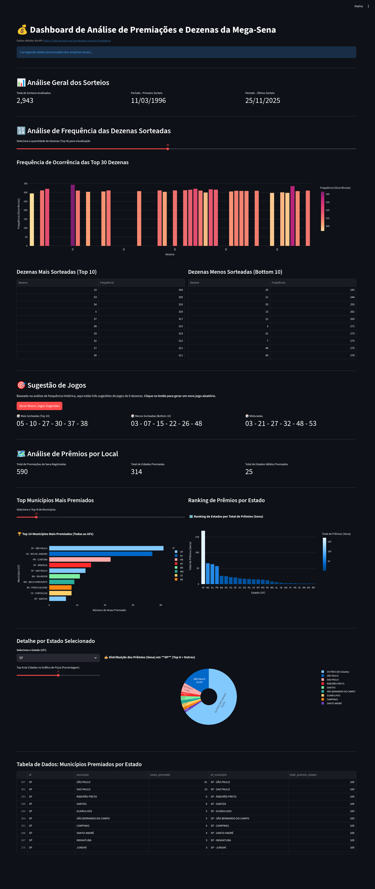

# 💰 Análise de Tendências e Distribuição de Prêmios da Mega-Sena


# Claudia Masumi Onizuka

# Rodrigo Fonseca Coutinho

# Vinicius Negrin Gregorio


## 🎯 Tema e Justificativa do Projeto

Este projeto consiste em um **Dashboard Interativo** desenvolvido em Python com a biblioteca Streamlit. O tema é a **Mega-Sena**.

A escolha do tema foi motivada pelo interesse em desmistificar, de forma lúdica e analítica, os resultados históricos dessa loteria. O dashboard oferece uma visão clara das **dezenas mais (e menos) sorteadas**, sugere jogos e compara com o historico de jogos sorteados bem como a **distribuição geográfica dos grandes prêmios (Sena)**, transformando o palpite em um exercício estatístico e geográfico.

---

---

## 💾 Fonte de Dados (API)

Os dados utilizados neste dashboard são extraídos de uma API pública e não-oficial que consolida os resultados históricos da Caixa Econômica Federal.

* **Fonte da API:** `https://loteriascaixa-api.herokuapp.com/api/megasena`
* **Descrição dos Dados:** A API fornece o resultado completo de todos os concursos já realizados da Mega-Sena, incluindo:
    * **Concurso e Data:** Número e data do sorteio.
    * **Dezenas Sorteadas:** A lista das 6 dezenas vencedoras.
    * **Local de Ganhadores:** Informações sobre os municípios e estados onde o prêmio principal (Sena) foi acertado.

---

## ❓ Perguntas-Chave Respondidas pelo Dashboard

O painel interativo foi projetado para responder às seguintes questões de análise:

### Frequência de Dezenas
1.  Quais são as **dezenas mais sorteadas** (dezenas "quentes") e as **menos sorteadas** (dezenas "frias") em toda a história da Mega-Sena?
2.  Com base na frequência histórica, quais são as sugestões de jogos gerados de forma automática? Esses conjuntos de sugestões já foram sorteados antes? 
3.  Como é a distribuição de frequência de ocorrência de todas as 60 dezenas?

### Sugestão de Jogos e Verificação de Repetição
1. Analisa se entre os conjuntos de 06 dezenas sorteadas nos concursos já houve alguma repetição, ou seja se o conjunto de 06 dezenas sorteadas já foram sorteadas mais de uma vez.
2. Faz sugetão de jogos aleatórios com as 10 dezenas com mais ocorrência, as 10 com menos ocorrência e misturadas; e após, verifica no historico de sorteios se alguma sugestão já foi sorteada anteriormente.

### Distribuição Geográfica de Prêmios (Sena)
4.  Qual é o **total de prêmios principais (Sena)** já distribuídos?
5.  Quais são os **municípios e estados** que registraram o maior número de acertos da Sena?
6.  Como a distribuição de prêmios se comporta dentro de um **estado específico**, mostrando o ranqueamento das cidades premiadas?

---

## 🚀 Como Rodar o Projeto Localmente

Siga os passos abaixo para configurar e executar o dashboard no seu computador.
Alternativamente o dashboard esta disponivel para visualização em:
Link: http://megasenaed.ddns.net:8501/

### Pré-requisitos
Certifique-se de ter o **Python (versão 3.8+)** e o `pip` (gerenciador de pacotes) instalados.

### 1. Instalação das Dependências

Instale as bibliotecas necessárias usando o `pip`:

```bash
pip install streamlit pandas requests plotly

```

### 2. Configuração do Arquivo
Para clonar o repositório localmente:
```bash
git clone https://github.com/yumyka/projeto-ED
```
ou manualmente copie e salve o código Python completo de alguma versão megasenavX.X.py em um arquivo local como por exemplo megasenav0.7.py

### 3. Execução do Dashboard
Abra o terminal ou prompt de comando na pasta raiz do repositório clonado ou onde você salvou o arquivo .py e execute o comando Streamlit:

Bash
```bash
streamlit run megasenav0.7.py
```
O Streamlit irá iniciar o aplicativo e abrir automaticamente uma nova aba no seu navegador padrão, mostrando o dashboard em execução.

Observação sobre Cache
Na primeira execução, o aplicativo irá baixar e processar todos os dados da API, salvando-os em arquivos CSV locais (megasena_premios_municipios.csv e megasena_dezenas_frequencia.csv). Em execuções subsequentes, o Streamlit usará esses arquivos em cache, acelerando o carregamento. Se quiser forçar o download e reprocessamento, você deve deletar esses arquivos CSV da pasta do projeto.
